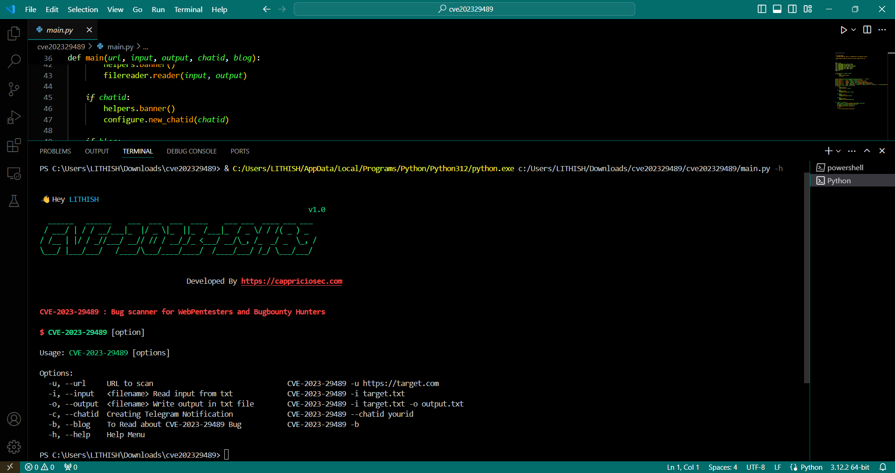
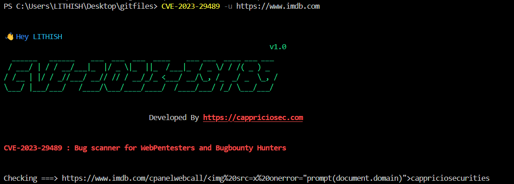

# Introduction:

An exploitable reflected cross-site scripting (XSS) vulnerability has been discovered in certain versions of cPanel and was assigned with CVE-2023-29489. This vulnerability allows attackers to execute arbitrary JavaScript code without requiring authentication. The XSS vulnerability can still be exploited even if the cPanel management ports are not externally exposed. Websites on ports 80 and 443 are also susceptible to this vulnerability if they are managed by cPanel.

#### Installation Procedure

# Install python3

[python](https://www.python.org/downloads/) 

Install pip - 

`
pip install CVE-2023-4568
`

Run - main.py file and at end type -h to run the tool

# Uses:

URL TO SCAN

`
CVE-2023-29489 -u (paste the url)
`

